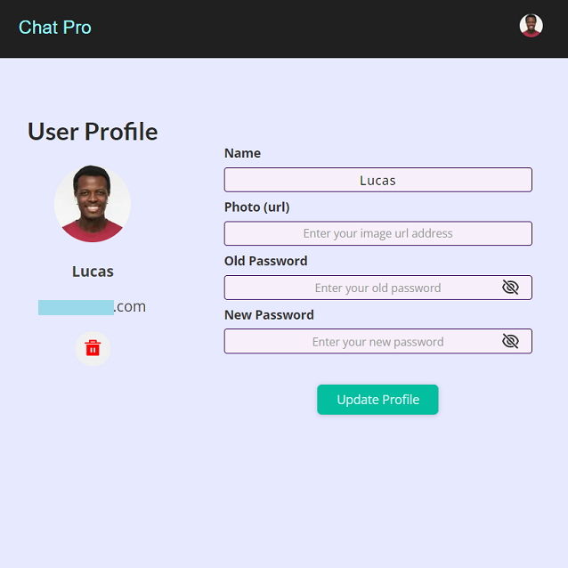

## Next js, Express, Mongo db, Socket.io chat pro app

- Next js
- React Context api
- Mongo db / Mongoose
- Next auth
- Socket.io v.4
- Express
- Node js
- Responsive design (mobile first styles)
- Notifications: message is typing, chat join/leave, auth form validation, user info updated (error, pending, success)
- Chat options: group messaging, private messaging, new message alert, users online, chat room members online
- Chat messages' variations: text, emojis, text + emojis
- Storage: private messages are backed up on a Mongo db server

 

## _Previews_

| Private chat screen | Group chat mobile screen | User profile screen |
| ------ | ------ | ------ |
|  |  |  |

  

[View the app](https://chatroomspro.netlify.app)
